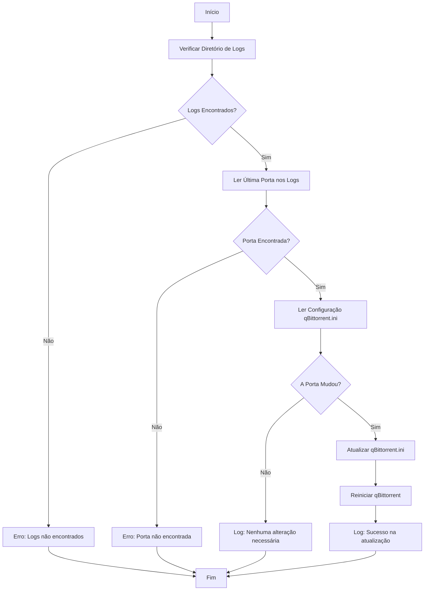

# Proton qBittorrent Sync

[](https://opensource.org/licenses/MIT)
[](https://microsoft.com/powershell)
[](https://www.microsoft.com/windows)

Utilitário automatizado para sincronizar a porta de encaminhamento (Port Forwarding) do **Proton VPN** com o cliente **qBittorrent** no Windows.

---

## 📋 Visão Geral

O Proton VPN rotaciona a porta de encaminhamento periodicamente ou a cada reconexão. Manter essa porta atualizada manualmente no qBittorrent é trabalhoso e propenso a falhas, resultando em quedas de conectividade para uploads e downloads.

Este script resolve o problema de forma silenciosa e eficiente:
1.  **Monitora** os logs do Proton VPN para extrair a porta ativa mais recente.
2.  **Verifica** a configuração atual do qBittorrent (`qBittorrent.ini`).
3.  **Atualiza** a porta automaticamente apenas se houver mudança.
4.  **Reinicia** o qBittorrent para aplicar as alterações, garantindo conexão contínua.

### Fluxo de Execução



## ✨ Recursos

- **Detecção Inteligente:** Localiza automaticamente os caminhos padrão de instalação e logs.
- **Preservação de Dados:** Mantém o encoding e formatação originais do arquivo de configuração do qBittorrent.
- **Logging Detalhado:** Registra todas as operações em `%ProgramData%\ProtonQbitPortSync`, facilitando diagnósticos.
- **Modo Silencioso:** Pode ser executado em background sem janelas pop-up (ideal para agendamentos).
- **Flexível:** Suporta substituição de caminhos via parâmetros para instalações personalizadas.

## 🚀 Pré-requisitos

- **Sistema Operacional:** Windows 10 ou 11.
- **VPN:** Proton VPN com a opção *Port Forwarding* ativada.
- **Cliente Torrent:** qBittorrent instalado.
- **Ambiente:** PowerShell 5.1 ou superior (nativo no Windows).

## 🛠️ Instalação Rápida

1.  **Prepare o Diretório**
    Crie uma pasta permanente para o script. Recomendamos:
    ```powershell
    C:\Scripts\proton-qbit-port-sync
    ```

2.  **Copie os Arquivos**
    Baixe e coloque os seguintes arquivos na pasta criada:
    - `proton-qbit-port-sync.ps1`
    - `proton-qbit-port-sync.bat`

3.  **Teste a Execução**
    Execute o arquivo `.bat` manualmente (duplo clique) para garantir que o script roda sem erros e cria o log inicial.

## 📖 Como Usar

### Execução Manual
Para testar ou forçar uma sincronização imediata, você pode rodar via PowerShell:

```powershell
powershell -NoProfile -ExecutionPolicy Bypass -File "C:\Scripts\proton-qbit-port-sync\proton-qbit-port-sync.ps1"
```

Ou simplesmente execute o arquivo `proton-qbit-port-sync.bat`.

### Automação (Recomendado)
Para que a sincronização ocorra automaticamente sempre que você fizer login ou o computador ligar:

#### Opção A: Importar Tarefa (Fácil)
1. Abra o **Agendador de Tarefas** do Windows (`taskschd.msc`).
2. Clique em **Importar Tarefa...** no painel direito.
3. Selecione o arquivo `task-scheduler-example.xml` incluído neste repositório.
4. Edite a ação para apontar para o caminho onde você salvou o script.
5. Salve.

#### Opção B: Criar Tarefa Manualmente
Crie uma nova tarefa com as seguintes configurações principais:
- **Geral:** "Executar com privilégios mais altos" (Admin).
- **Disparador:** "Ao fazer logon" (com atraso de 3 minutos para dar tempo à VPN conectar).
- **Ação:** Iniciar programa.
  - Programa: `powershell.exe`
  - Argumentos: `-WindowStyle Hidden -ExecutionPolicy Bypass -File "C:\Scripts\proton-qbit-port-sync\proton-qbit-port-sync.ps1"`

## ⚙️ Parâmetros Avançados

O script aceita diversos parâmetros para customizar seu comportamento.

| Parâmetro | Padrão | Descrição |
| :--- | :--- | :--- |
| `-ProtonVpnLogDir` | `%LOCALAPPDATA%\Proton...` | Diretório onde o Proton VPN salva seus logs. |
| `-QbitConfigPath` | `%APPDATA%\qBittorrent...` | Caminho completo para o arquivo `qBittorrent.ini`. |
| `-QbitExePath` | *Auto-detect* | Caminho do executável `qbittorrent.exe`. Se vazio, tenta detectar automaticamente. |
| `-LogPath` | `%ProgramData%\Proton...` | Caminho onde o log de execução do script será salvo. |
| `-LogTailLines` | `2000` | Quantidade de linhas recentes do log a serem analisadas. |
| `-SkipRestartIfSame`| `False` | Se usado, evita reiniciar o qBittorrent se a porta não tiver mudado. |

**Exemplo de uso com parâmetros:**
```powershell
.\proton-qbit-port-sync.ps1 -LogTailLines 5000 -SkipRestartIfSame
```

## 🔒 Segurança

> [!IMPORTANT]
> Este script roda com permissões elevadas se configurado via Agendador de Tarefas. 

- **Credenciais:** O script **NÃO** lê nem armazena credenciais do Proton VPN ou do qBittorrent. Apenas lê arquivos de log e configuração locais.
- **Rede:** Nenhuma conexão externa é feita pelo script. Tudo ocorre localmente (localhost/arquivos).
- **Logs:** Os logs gerados pelo script podem conter o número da porta e caminhos de arquivos, mas não contêm dados sensíveis do usuário.

## 🗑️ Desinstalação

Para remover a automação e o script:

1.  Abra o **Agendador de Tarefas** e exclua a tarefa criada (ex: "Proton qBittorrent Port Sync").
2.  Delete a pasta onde você salvou o script (ex: `C:\Scripts\proton-qbit-port-sync`).
3.  (Opcional) Delete a pasta de logs: `%ProgramData%\ProtonQbitPortSync`.

## ❓ Solução de Problemas

| Problema | Possível Causa | Solução |
| :--- | :--- | :--- |
| **"No 'Port pair' entry found"** | VPN desconectada ou sem Port Forwarding. | Verifique se o Proton VPN está conectado e se o ícone de Port Forwarding está ativo. |
| **qBittorrent não reinicia** | Falta de privilégios. | Execute o script ou o Agendador de Tarefas como Administrador. |
| **Configuração não atualizada** | Arquivo `ini` bloqueado ou caminho errado. | Verifique se o caminho do `qBittorrent.ini` está correto em `%APPDATA%`. |

---

<div align="center">
  <sub>Desenvolvido para simplificar a vida de usuários Proton VPN + qBittorrent.</sub>
</div>
