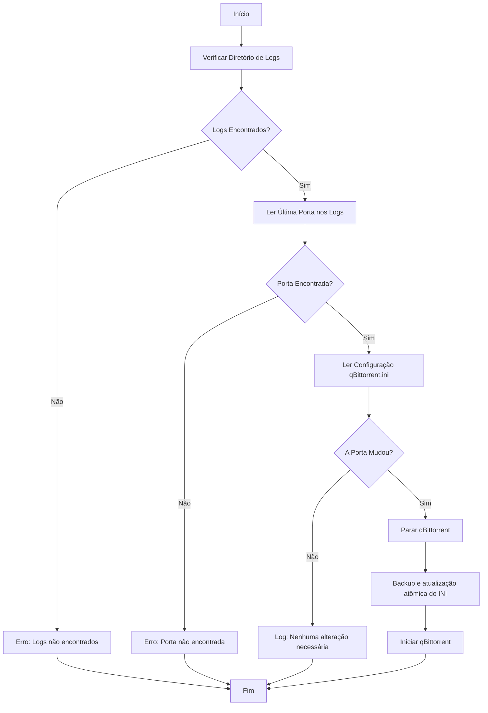

# Proton qBittorrent Sync

[](https://opensource.org/licenses/MIT)
[](https://microsoft.com/powershell)
[](https://www.microsoft.com/windows)

Utilitário automatizado para sincronizar a porta de encaminhamento (Port Forwarding) do **Proton VPN** com o cliente **qBittorrent** no Windows.

---

## 📋 Visão Geral

O Proton VPN rotaciona a porta de encaminhamento periodicamente ou a cada reconexão. Manter essa porta atualizada manualmente no qBittorrent é trabalhoso e propenso a falhas, resultando em quedas de conectividade para uploads e downloads.

Este script resolve o problema de forma silenciosa e eficiente:
1.  **Monitora** os logs do Proton VPN para extrair a porta ativa mais recente.
2.  **Verifica** a configuração atual do qBittorrent (`qBittorrent.ini`).
3.  **Atualiza** a porta automaticamente apenas se houver mudança.
4.  **Reinicia** o qBittorrent, caso ele já estivesse em execução, para aplicar a alteração.

### Fluxo de Execução


```mermaid
graph TD
    A[Início] --> B[Verificar Diretório de Logs]
    B --> C{Logs Encontrados?}
    C -- Não --> D[Erro: Logs não encontrados]
    C -- Sim --> E[Ler Última Porta nos Logs]
    E --> F{Porta Encontrada?}
    F -- Não --> G[Erro: Porta não encontrada]
    F -- Sim --> H[Ler Configuração qBittorrent.ini]
    H --> I{A Porta Mudou?}
    I -- Não --> J[Log: Nenhuma alteração necessária]
    J --> End[Fim]
    I -- Sim --> K[Parar qBittorrent]
    K --> L[Backup e atualização atômica do INI]
    L --> M[Iniciar qBittorrent]
    M --> End
    D --> End
    G --> End
```

## ✨ Recursos

- **Detecção Inteligente:** Localiza automaticamente os caminhos padrão de instalação e logs.
- **Validação de Atualidade:** Recusa portas antigas deixadas no log após uma desconexão da VPN.
- **Preservação de Dados:** Mantém encoding e quebras de linha, cria backup e substitui o INI de forma atômica.
- **Execução Única:** Impede duas sincronizações concorrentes e reinicia somente quando a porta muda.
- **Logging Detalhado:** Registra as operações em `%LOCALAPPDATA%\ProtonQbitPortSync` e rotaciona o arquivo automaticamente.
- **Modo Silencioso:** Pode ser executado em background sem janelas pop-up (ideal para agendamentos).
- **Flexível:** Suporta substituição de caminhos via parâmetros para instalações personalizadas.

## 🚀 Pré-requisitos

- **Sistema Operacional:** Windows 10 ou 11.
- **VPN:** Proton VPN com a opção *Port Forwarding* ativada.
- **Cliente Torrent:** qBittorrent instalado.
- **Ambiente:** PowerShell 5.1 ou superior (nativo no Windows).

## 🛠️ Instalação Rápida

1.  **Prepare o Diretório**
    Crie uma pasta permanente para o script. Recomendamos:
    ```powershell
    C:\Scripts\proton-qbit-port-sync
    ```

2.  **Copie o projeto**
    Baixe o repositório e coloque estes arquivos na pasta criada:
    - `proton-qbit-port-sync.ps1`
    - `proton-qbit-port-sync.bat`
    - `proton-qbit-port-sync.vbs`
    - `install-task.ps1`
    - a pasta `tests`, caso queira executar a validação local

3.  **Execute os testes**
    ```powershell
    powershell -NoProfile -ExecutionPolicy Bypass -File .\tests\proton-qbit-port-sync.tests.ps1
    ```

## 📖 Como Usar

### Execução Manual
Para testar ou forçar uma sincronização imediata, você pode rodar via PowerShell:

```powershell
powershell -NoProfile -ExecutionPolicy Bypass -File "C:\Scripts\proton-qbit-port-sync\proton-qbit-port-sync.ps1"
```

Ou simplesmente execute o arquivo `proton-qbit-port-sync.bat`.

### Automação (Recomendado)
Como a porta pode mudar após qualquer reconexão da VPN, a tarefa roda no logon e se repete a cada 2 minutos. Quando a porta não muda, o script termina sem reiniciar o qBittorrent.

#### Opção A: Instalador (Recomendado)
Execute no PowerShell com o mesmo usuário que executa o qBittorrent:

```powershell
.\install-task.ps1
```

O comando cria ou atualiza `proton-qbit-port-sync`, usa o caminho atual do projeto e não exige privilégios administrativos.

#### Opção B: Importar ou criar manualmente
O arquivo `task-scheduler-example.xml` é um modelo portátil. Antes de importá-lo, substitua:

- `__USER_ACCOUNT__` pela conta no formato `COMPUTADOR\usuario`.
- `__INSTALL_DIR__` pelo caminho completo da pasta do projeto, sem barra final.

Depois, importe o XML no Agendador de Tarefas. Como alternativa, crie a tarefa com estas configurações:
- **Geral:** executar apenas quando o usuário estiver conectado, sem privilégios elevados.
- **Disparador:** ao fazer logon, atraso de 1 minuto e repetição a cada 2 minutos.
- **Ação:** Iniciar programa.
  - Programa: `C:\Windows\System32\wscript.exe`
  - Argumentos: `//B //NoLogo "C:\Scripts\proton-qbit-port-sync\proton-qbit-port-sync.vbs"`

## ⚙️ Parâmetros Avançados

O script aceita diversos parâmetros para customizar seu comportamento.

| Parâmetro | Padrão | Descrição |
| :--- | :--- | :--- |
| `-ProtonVpnLogDir` | `%LOCALAPPDATA%\Proton...` | Diretório onde o Proton VPN salva seus logs. |
| `-QbitConfigPath` | `%APPDATA%\qBittorrent...` | Caminho completo para o arquivo `qBittorrent.ini`. |
| `-QbitExePath` | *Auto-detect* | Caminho do executável `qbittorrent.exe`. Se vazio, tenta detectar automaticamente. |
| `-LogPath` | `%LOCALAPPDATA%\Proton...` | Caminho onde o log de execução do script será salvo. |
| `-LogTailLines` | `5000` | Quantidade de linhas recentes de cada log a serem analisadas. |
| `-MaxPortAgeMinutes` | `10` | Recusa uma porta cuja última ocorrência seja mais antiga. Use `0` para desabilitar. |
| `-MaxLogSizeMB` | `5` | Rotaciona o log da automação ao atingir este tamanho. |
| `-NoRestart` | `False` | Atualiza o INI sem tocar no processo; a porta só será aplicada no próximo início. |
| `-StartIfNotRunning` | `False` | Inicia o qBittorrent após alterar a porta mesmo se ele estava fechado. |
| `-ForceRestart` | `False` | Reinicia mesmo quando a porta já está correta. |
| `-SkipRestartIfSame` | `False` | Compatibilidade com versões anteriores; não é mais necessário, pois este é o comportamento padrão. |

**Exemplo de uso com parâmetros:**
```powershell
.\proton-qbit-port-sync.ps1 -MaxPortAgeMinutes 15
```

## 🔒 Segurança

- **Credenciais:** O script **NÃO** lê nem armazena credenciais do Proton VPN ou do qBittorrent. Apenas lê arquivos de log e configuração locais.
- **Rede:** Nenhuma conexão externa é feita pelo script. Tudo ocorre em arquivos e processos locais.
- **Logs:** Os logs gerados pelo script podem conter o número da porta e caminhos de arquivos, mas não contêm dados sensíveis do usuário.
- **Processo:** Se o fechamento normal não estiver disponível (por exemplo, qBittorrent apenas na bandeja), o script força o encerramento antes de alterar o INI e registra isso no log.

## 🗑️ Desinstalação

Para remover a automação e o script:

1.  Abra o **Agendador de Tarefas** e exclua a tarefa criada (ex: "Proton qBittorrent Port Sync").
2.  Delete a pasta onde você salvou o script (ex: `C:\Scripts\proton-qbit-port-sync`).
3.  (Opcional) Delete a pasta de logs: `%LOCALAPPDATA%\ProtonQbitPortSync`.

## ❓ Solução de Problemas

| Problema | Possível Causa | Solução |
| :--- | :--- | :--- |
| **"No 'Port pair' entry found"** | VPN desconectada ou sem Port Forwarding. | Verifique se o Proton VPN está conectado e se o ícone de Port Forwarding está ativo. |
| **Porta do log está obsoleta** | VPN desconectada ou sem atualização recente. | Reconecte a VPN e confirme que Port Forwarding está ativo. |
| **qBittorrent não reinicia** | Executável não encontrado. | Informe `-QbitExePath` com o caminho completo. |
| **Configuração não atualizada** | Arquivo `ini` bloqueado ou caminho errado. | Verifique se o caminho do `qBittorrent.ini` está correto em `%APPDATA%`. |

---

<div align="center">
  <sub>Desenvolvido para simplificar a vida de usuários Proton VPN + qBittorrent.</sub>
</div>
